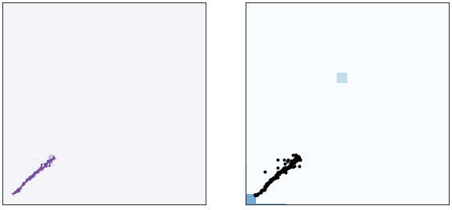
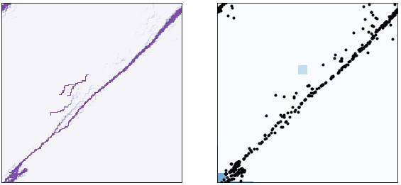
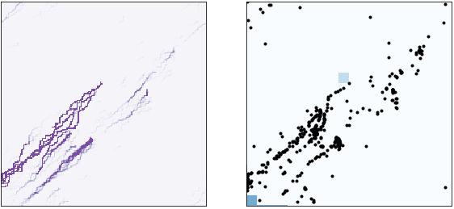

# Emergent Path Planning of Foraging Army Ants
### Will Fairman and David Tarazi

## Abstract

J.L. Deneubourg, S. Goss, N. Franks, and J.M. Pasteels model the foraging patterns of army ant colonies in "The Blind Leading the Blind: Modeling Chemically Mediated Army Ant Raid Patterns". Army ant colonies are able to create networks of hundreds of thousands of ants that can forage and return food to the nest. The impressive part of this ability is that each ant can only see and interact with it's direct surroundings by measuring the amount of pheromones present. Using an agent-based model where each ant produces and moves towards pheromones, the authors were able to recreate the foraging patterns of army ants. After recreating the authors' work with an agent-based model in Python, we expanded their analysis by looking into how food distributions and competition affects the foraging patterns of army ants.

## Experiment

INCLUDE SOMETHING HERE ABOUT OUR BEEHIVE ATTEMPT: Too many rules/not enough detailed explanations about the mechanics of the model.

To replicate the authors' model, we reduced the characteristics of army ants discussed in the paper to a series of simple of rules. There are nearly a dozen rules that affect an ant's movement, however, the main rules that dictate movement are listed below: 

1. Ants will always face a diagonal direction (NE, NW, SW, SE) and can only move to a square directly to the left or right of their location. For example, a NE facing ant can only move North or East.

1. Ants lay more pheromones when carrying food versus foraging.
 
1. The probability that an ant chooses a location is based on the amount of pheromone present at that location. If not enough pheromone is present, an ant will remain in its current location.

1. Each square can only hold a limited amount of ants. If an ant has no viable places to move, it remains stationary.

To expand upon the authors' work, we wanted to characterize the affect of food distributions on foraging patterns. 

INSERT WHATEVER WE DID AFTER WE DO IT.

We also looked into how competing colonies can affect foraging patterns. 

INSERT WHATEVER WE DID AFTER WE DO IT.

## Results

## Replication

The model referenced in the paper shows foraging patterns for two types of food sources. In the first environment, food is scattered so that each square has a 50% chance of containing a unit of food. The associated forgaging pattern is shown in Figure 1. In this scenario, where food is abundant in small quantities, the foraging pattern consists of well defined paths near the base that branch out when approaching the furthest ant. At the most distant point from the nest, the ants are arranged in an almost random pattern.

**Figure 1:** Foraging pattern of the army ant model in the original paper. In this scenario, food is spread evenly with each sqaure having a 50% chance of containing one unit of food.

In the second environment, shown in Figure 2, large units of food are spread across a few points. Near the nest, the foraging pattern is consist with Figure 1. However, instead of observing a large cluster of ants near the top of the network, Figure 2 has smaller clusters of ants surrounding sources of food located within the foraging network. 

**Figure 2:** Foraging pattern of the army ant model in the original paper. In this scenario, each square only has a 1% chance of containing food. If a square contains food, it contains 400 units of food.

Figures 3 through 5 show our attempt at creating a working model. In each of these figures there is a small square that contains an infinite amount of food. This environment was created to prove that the mechanics of the model were working but do not directly compare to Figures 1 and 2. (In the final version we will have direct comparisons.)

**Figure 3:** Foraging pattern of our army ant model after 100 steps. The array on the left shows the level of pheromones in the environment. The darker shades of purple correspond to more pheromones. The array on the right shows the army ants (black circles), food source (medium shade of blue), and the nest (darkest shade of blue).

**Figure 4:** Foraging pattern of our army ant model after 500 steps. The arrays and organized in a similar fashion to Figure 3. 

  

**Figure 5:** Foraging pattern of our army ant model after 1500 steps. The arrays and organized in a similar fashion to Figure 3. 

## Causes of Concern

## Annotated Bibliography
[The Blind Leading the Blind:  Modeling  Chemically Mediated  Army  Ant Raid  Patterns](http://citeseerx.ist.psu.edu/viewdoc/download?doi=10.1.1.468.5005&rep=rep1&type=pdf)  
J. L. Deneubourg, S. Goss, N. Franks, and J.M. Pasteels. The Blind Leading the Blind:  Modeling  Chemically Mediated  Army  Ant Raid  Patterns. Journal of Insect Behavior, Vol. 2, No. 5, 1989 
>This paper discsusses modeling the foraging behavior of army ants.

[Chapter 12 Case Study: Ant Trails](https://greenteapress.com/complexity/html/thinkcomplexity013.html#fig.plot)
Chapter 12  Case study: Ant trails. Chloe Vilain and Andrew Pikler
>A website dicussing the implementation of an agent-based army ant model. This website also references "The Blind Leading the Blind:  Modeling  Chemically Mediated  Army  Ant Raid  Patterns".

## Supporting Code

Link to colab after we finish