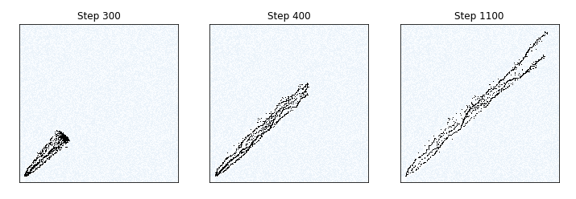

# Emergent Path Planning of Foraging Army Ants
### Will Fairman and David Tarazi

## Abstract

J.L. Deneubourg, S. Goss, N. Franks, and J.M. Pasteels model the foraging patterns of army ant colonies in "The Blind Leading the Blind: Modeling Chemically Mediated Army Ant Raid Patterns." Army ant colonies are able to create networks of hundreds of thousands of ants that can forage and return food to the nest. The impressive part of this ability is that each ant can only see and interact with its direct surroundings by sensing the amount of pheromones dropped by other ants. Using an agent-based model where each ant produces and moves towards pheromones, the authors were able to recreate the foraging patterns of army ants. After recreating the authors' work with an agent-based model in Python, we expanded their analysis by looking into how rudimentary competition affects the foraging patterns of army ants. In our results, we saw similar outcomes from our replication compared to the original authors' results. With our extension, we observed that ants in a competitive environment weaved around or through each other to access food.

## Experiment

In their explanation of an army ant colony behavior, the authors discussed rules that an agent-based model should have to accurately reflect an individual army ant's movement. We condensed this information into the following set of rules. Some of the rules are governed by a tune-able parameter. 

| Rule | Model Parameter|
|-|-|
|Ants will always face a diagonal direction (NE, NW, SW, SE) and can only move to a square directly to the left or right of their location. For example, a NE facing ant can only move North or East.| `starting_dir`|
|Ants lay more pheromones when carrying food versus foraging, though they still lay some pheromones when foraging.|`p_foraging`  `p_returning`|
|For every step, a percentage of pheromone evaporates from each point.| `p_decay`|
|The probability that an ant chooses a location is based on the amount of pheromone present at that location.| N/A |
|If not enough pheromone is present, an ant will remain in its current location. Any any returning to the nest will be more likely to continue moving if there is little pheromone present.| `sigmoid_going`  `sigmoid_returning`|
|Each square can only hold a limited amount of ants. If an ant has no viable places to move, it remains stationary.| `ants_per_cell` |
|Once an ant finds food, it switches direction and returns to the nest. After returning to the nest to drop off the food, the ant is removed from the model.| N/A |
|To keep a stream of ants foraging, a set number of ants leave the nest on each step of the simulation. | `ants_per_step`| 
|In rare cases, when an ant is returning with food and deviates from the path of other ants and there are minimal pheromones, the returning ant will move back to the stream of ants.| N/A |

**Table 1:** Set of rules and associated parameters that define how an individual ant agent acts in our model.

To initialize an environment, the authors gave each square a probability of containing a food unit: defined as the amount of food a single ant would consume when landing on the square. In our replication, we tested two types of environments that the authors created. In the first environment, every square had a 50% probability of containing 1 unit of food. In the second environment, each square had a 1% probability of containing 400 units of food. These environments were selected to observe how foraging trails would be affected by the distribution of food sources.

To expand on the authors' work, we experimented with competing colonies that are both foraging for the same food in the environment to see how they would navigate the space together given the same rules. To implement this experiment, we created two simulations with a shared map of the environment food and environment ants, but we did not add any rules with how the ants would act when they collided with another colony. The ants would only follow pheromones from their respective colonies. 

## Results

### Replication

The authors were not explicit about the values they used for the parameters in their model. This made it difficult to recreate the patterns the authors presented in their figures. For tuning and debugging purposes (pun intended), we plotted food, ant, and pheromone counts on a grid, as shown in Figure 1, to better understand how our list of parameters affected ant movement.

**Figure 1:** Example of a modeled army ant colony foraging. The figure displays the amount of food, ants, and pheromones present in each grid of the environment. For each three subplots, a darker color is associated with a higher concentration of the variable of interest.

In the first environment, food is scattered so that each square has a 50% chance of containing a unit of food. The associated foraging pattern created by the original authors is shown in Figure 2. In this scenario, where food is abundant in small quantities, the foraging pattern consists of well defined paths near the base that branch out when approaching the furthest ant. At the most distant point from the nest, the ants are arranged in an almost random pattern.

**Figure 2:** Foraging pattern of the army ant model in the original paper. In this scenario, food is spread evenly with each cell in the environment having a 50% chance of containing one unit of food. 

In our replication, shown in Figure 3, we copied as many parameters as we could find. We started with a similar initial food distribution, released the same amount of ants from the nest at each time step (10), and had the same returning to foraging ratio for the amount of pheromones released (10:1). We observed mostly consistent results to the original paper's results. After just 300 steps, there is a clear cluster of ants moving forward that widens as the ants move away from the nest. However, the ants have already started branching off at this point in the simulation. The early branching is not represented in the original paper's results.

After 700 steps and likewise after 1100 steps, we see more consistent results as the stream of ants in the beginning leading out of the nest aligns with the original paper's results. Then, we see some branching as ants are still finding new paths to find food in the environment leading to a few branches where food was found consistently. Unlike the authors' results, we do not see a mass of ants collecting at the furthest point of the trail. The amount of branches are also much smaller and the distance between each trail is much closer in our results. This suggests that the ants in our model are more inclined to either follow a trail or travel in a straight direction away from the nest. After tuning our parameters, this behavior continued to reemerge in almost every instance. We're not sure why this pattern is different in the original paper's results, but we anticipate it is due to the parameters that we tuned ourselves and possibly some behaviors with maximum amounts of ants being inconsistent with the original implementation.

**Figure 3:** Foraging pattern of our army ant model after 300, 400, and 1100 steps with a 50% chance that any cell has a single unit of food.

In the second environment created by the original authors, shown in Figure 4, large units of food are spread across a few points. Near the nest, the foraging pattern is consistent with Figure 1. However, instead of observing a large cluster of ants near the top of the network, Figure 4 has smaller clusters of ants surrounding sources of food located within the foraging network. 

**Figure 4:** Foraging pattern of the army ant model in the original paper. In this scenario, each square only has a 1% chance of containing food. If a square contains food, it contains 400 units of food.

Our first attempt at replicating the army ant foraging pattern in a sparse environment is shown in Figure 5. The original paper suggested that the distribution of food alone should change the behavior of the ant model. However, the foraging pattern in Figure 5 is not substantially different than the pattern shown in Figure 3. The main visible difference is a more prominent trail with less branching near the nest in Figure 5. This is expected given that the scarcity of food decreases the chances of food near the nest and reduces the chances of pheromone trails being laid early in the foraging time steps.

**Figure 5:** Foraging pattern of our army ant model after 500, 1000, and 1300 steps. The ant model uses the same parameters as Figure 3 and each square in the environment has a 1% chance of containing 400 units of food.

 To recreate the pattern shown in Figure 4, we modified the parameters of our model. In particular, we increased the amount of pheromone laid after an ant found food and made the ants more likely to wait while foraging if pheromone levels were too low. These changes were made to spread the ants further apart and make food sources more visible by increasing the levels of pheromones around the food.

Our second attempt is shown in Figure 6. After 500 steps, the ants haven't really found much food and so clusters haven't started to form as obviously yet as the authors saw in their original model. After 1000 steps, we see minor branching but no substantial signs of clustering. We also see a few "lost" ants that the authors' results also show. These ants are disconnected from the group and likely have deviated after going towards smaller clusters of food, but the source dissipated. While their friends returned to the nest, they are still in the area looking for food. In general we don't see clumping of ants around the food sources as suggested by the authors' findings.

**Figure 6:** Foraging pattern of our army ant model after 500, 1000, and 1300 steps. The ant model uses modified parameters in an attempt to better replicate the authors' results. Each square in the environment has a 1% chance of containing 400 units of food.

### Extension

After replicating the original implementation, we started investigating how passive foraging ant colonies interact with each other and navigate a busier environment. In Figures 7 through 9, we look at our model when we have a colony placed in both the bottom left and top right corners of the environment foraging towards each other up to 2000 steps into the simulation. 

**Figure 7:** Foraging pattern of our army ant model with a couple of colonies reaching first contact after 1000 steps with a 50% chance that any cell has a single unit of food. The red ants are a part of the first colony and the black ants are a part of the second colony. Faint blue cells represent the food in the environment.

**Figure 8:** Foraging pattern of our army ant model with a couple of colonies reaching first contact after 1500 steps with a 50% chance that any cell has a single unit of food. The red ants are a part of the first colony and the black ants are a part of the second colony. Faint blue cells represent the food in the environment.

**Figure 9:** Foraging pattern of our army ant model with a couple of colonies reaching first contact after 2000 steps with a 50% chance that any cell has a single unit of food. The red ants are a part of the first colony and the black ants are a part of the second colony. Faint blue cells represent the food in the environment.

Analyzing this simulation, we see that the ants almost flow through each other like a liquid at first. However, after 2000 steps, it's clear that they each have taken a side while some branches of foraging still overlap with the other colony. The branches extend further and stay dispersed as the colonies forage for food. Had we extended this model further, we would have added behaviors of ant colonies foraging for food in a less friendly environment to better understand the competition between colonies.

## Attempted Beehive Implementation

Prior to replicating this ant foraging model, we first attempted to replicate Hogeweg and Hesper's beehive model. When attempting to implement their model, we realized that there were a few problems. For one, there was one aspect of their model that didn't align with any modern literature on actual bee behavior. The paper seemed to suggest that the queen was laying eggs on top of pupa after which the pupa would be pushed outside of the center of the hive. Another issue we struggled with was due to the age of the model. The way that the authors implemented their model was under conditions with low compute power that created some funky rules that didn't seem practical given modern technology. Lastly, this model had dozens of rules and variables, many of which we assumed would be clearly defined but were vague and unclear. Due to these reasons, we were essentially guessing what the variables would be and didn't see the value in continuing replication. When attempting to read and implement models, it is important to keep in mind the time at which a model was created and the related problems that could arise. Additionally, we shouldn't have assumed that if we started implementing the model that the variables would become clearer and the model would eventually make sense. In the future, we know that these problems could appear and will more cautious when reading primary sources on complex models.

## Annotated Bibliography
[The Blind Leading the Blind:  Modeling  Chemically Mediated  Army  Ant Raid  Patterns](http://citeseerx.ist.psu.edu/viewdoc/download?doi=10.1.1.468.5005&rep=rep1&type=pdf)  
J. L. Deneubourg, S. Goss, N. Franks, and J.M. Pasteels. The Blind Leading the Blind:  Modeling  Chemically Mediated  Army  Ant Raid  Patterns. Journal of Insect Behavior, Vol. 2, No. 5, 1989 
>This paper discusses modeling the foraging behavior of army ants.

[Chapter 12 Case Study: Ant Trails](https://greenteapress.com/complexity/html/thinkcomplexity013.html#fig.plot)
Chapter 12  Case study: Ant trails. Chloe Vilain and Andrew Pikler
>A website discussing the implementation of an agent-based army ant model. This website also references "The Blind Leading the Blind:  Modeling  Chemically Mediated  Army  Ant Raid  Patterns".

[The Ontogeny of the Interaction Structure in Bumble Bee Colonies: A MIRROR Model](https://www.researchgate.net/publication/226134851_The_ontogeny_of_the_interaction_structure_in_bumble_bee_colonies_A_MIRROR_model)  
Hogeweg, P. and Hesper, B. (1983), 'The Ontogeny of the Interaction Structure in Bumble Bee Colonies: A MIRROR Model', Behavioral Ecology and Sociobiology, 12(4): 271-283
>The authors of this paper create a model for beehive behavior through bee agents of different roles within the hive. 

[Bumble Bee Colonies](https://www.gisagents.org/2015/03/bumble-bee-colonies.html)
Crooks, Andrew. “Bumble Bee Colonies.” GIS and Agent-Based Modeling, Mar. 2015, https://www.gisagents.org/2015/03/bumble-bee-colonies.html. 
>This website shows an implementation of the original paper we are trying to replicate which has a nice animation and gives us some inspiration on which variables matter to visualize.

## Supporting Code

To view our model, you can follow the link to Github [here](https://github.com/davidt315/ant_foraging_model/blob/main/code/main_notebook.ipynb)! You can also run our code on [Google Colab](https://colab.research.google.com/drive/1IbFJo6Ck7JZJhJ7LHEQyOvRy6ZMIRY6R?usp=sharing).