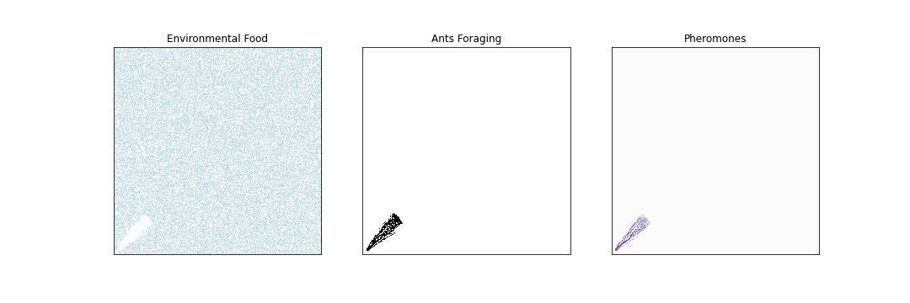
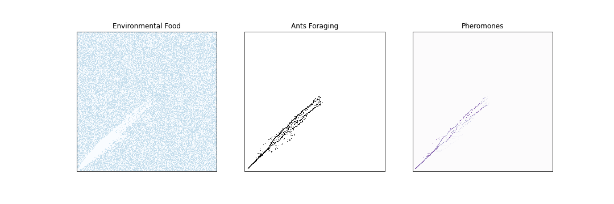

# Emergent Path Planning of Foraging Army Ants
### Will Fairman and David Tarazi

## Abstract

J.L. Deneubourg, S. Goss, N. Franks, and J.M. Pasteels model the foraging patterns of army ant colonies in "The Blind Leading the Blind: Modeling Chemically Mediated Army Ant Raid Patterns." Army ant colonies are able to create networks of hundreds of thousands of ants that can forage and return food to the nest. The impressive part of this ability is that each ant can only see and interact with it's direct surroundings by sensing the amount of pheromones dropped by other ants. Using an agent-based model where each ant produces and moves towards pheromones, the authors were able to recreate the foraging patterns of army ants. After recreating the authors' work with an agent-based model in Python, we expanded their analysis by looking into how rudimentary competition affects the foraging patterns of army ants. In our results, we saw similar outcomes from our replication compared to the original authors' results and observed ants when in a competitive environment weaved around or through each other to access food. We aim to start understanding colony foraging behavior when another ant colony is encountered

## Experiment
To replicate the authors' model, we followed the characteristics of army ants discussed in the paper while testing the tuning of parameters without a specified value. The main rules that dictate movement are listed below: 

1. Ants will always face a diagonal direction (NE, NW, SW, SE) and can only move to a square directly to the left or right of their location. For example, a NE facing ant can only move North or East.

1. Ants lay more pheromones when carrying food versus foraging, though they still lay some pheromones when foraging.

1. For every step, a percentage of pheromone evaporates from each point.
 
1. The probability that an ant chooses a location is based on the amount of pheromone present at that location. If not enough pheromone is present, an ant will remain in its current location.

1. Each square can only hold a limited amount of ants. If an ant has no viable places to move, it remains stationary.

1. Once an ant finds food, it switches direction and returns to the nest. After returning to the nest to drop off the food, the ant is removed from the model.

1. To keep a stream of ants foraging, a set number of ants leave the nest on each step of the simulation.

1. In rare cases, when an ant is returning with food and deviates from the path of other ants and there are minimal pheromones, the returning ant will move back to the stream of ants. 

In our replication, we tested two of the types of simulation that the original authors tested. The first being ants foraging with few large food sources in the environment, and the second being ants foraging with small amounts of food scattered throughout the environment. The results from these experiments are shown in the Results section. 

To expand on the authors' work, we experimented with competing colonies that are both foraging for the same food in the environment to see how they would navigate the space together given the same rules. To implement this experiment, we created two simulations with a shared map of the environment food and environment ants, but we did not add any rules with how the ants would act when they collided with another colony. The ants would only follow pheromones from their respective colonies. 
# TODO: maybe add a table with all our parameters?

## Results
### Replication

The model referenced in the paper shows foraging patterns for two types of food sources. In the first environment, food is scattered so that each square has a 50% chance of containing a unit of food. The associated foraging pattern created by the original authors is shown in Figure 1. In this scenario, where food is abundant in small quantities, the foraging pattern consists of well defined paths near the base that branch out when approaching the furthest ant. At the most distant point from the nest, the ants are arranged in an almost random pattern.

**Figure 1:** Foraging pattern of the army ant model in the original paper. In this scenario, food is spread evenly with each cell in the environment having a 50% chance of containing one unit of food.

Figures 2 through 4 show our replication of Figure 1, where there is a 50% chance that any cell has a single unit of food after a number of steps in our simulation.

**Figure 2:** Foraging pattern of our army ant model after 300 steps with a 50% chance that any cell has a single unit of food. The plot on the left shows the food remaining in the environment (represented by blue cells shaded with darker cells having more food). The center plot shows the ants themselves resembling what Figure 1 is showing. The plot on the right shows the pheromone levels shaded with darker cells having more pheromones.

**Figure 3:** Foraging pattern of our army ant model after 700 steps with a 50% chance that any cell has a single unit of food. The plot on the left shows the food remaining in the environment (represented by blue cells shaded with darker cells having more food). The center plot shows the ants themselves resembling what Figure 1 is showing. The plot on the right shows the pheromone levels shaded with darker cells having more pheromones.

**Figure 4:** Foraging pattern of our army ant model after 1100 steps with a 50% chance that any cell has a single unit of food. The plot on the left shows the food remaining in the environment (represented by blue cells shaded with darker cells having more food). The center plot shows the ants themselves resembling what Figure 1 is showing. The plot on the right shows the pheromone levels shaded with darker cells having more pheromones.

In our replication, we observed mostly consistent results to the original paper's results. After just 300 steps, there is a clear cluster of ants moving forward that is widens as the ants move forward, however, the ants have already started branching off at this point in the simulation. The early branching is not represented in the original paper's results, but it makes sense given how we have set up the model. If an ant finds food by randomly moving to the right out of the main path in the beginning, it will drop many more pheromones than the other ants that are moving outwards into the environment as shown by the pheromone plot in Figure 3. We're not quite sure why this pattern is different in the original paper's results, but we anticipate it is due to the parameters that we tuned ourselves and possibly some behaviors with maximum amounts of ants being inconsistent with the original implementation.

After 700 steps and likewise after 1100 steps, we see more consistent results as the stream of ants in the beginning leading out of the nest aligns with the original paper's results. Then, we see some branching as ants are still finding new paths to find food in the environment leading to a few branches where food was found consistently. However, we see some inconsistency in the amount of ants leading the group as our model doesn't have the platoon of ants leading the charge after 700 steps. We believe this is again due to some minor inconsistencies in our parameter values compared to the original paper's, but we believe there is enough evidence of sound replication in the qualitative results from the branching of ants that happens over time.

In the second environment created by the original authors, shown in Figure 5, large units of food are spread across a few points. Near the nest, the foraging pattern is consistent with Figure 1. However, instead of observing a large cluster of ants near the top of the network, Figure 5 has smaller clusters of ants surrounding sources of food located within the foraging network. 

**Figure 5:** Foraging pattern of the army ant model in the original paper. In this scenario, each square only has a 1% chance of containing food. If a square contains food, it contains 400 units of food.

Our replications with smaller clusters of food in larger amounts are shown in Figures 6 through 8.

**Figure 6:** Foraging pattern of our army ant model after 500 steps with a 1% chance that any cell has a 400 units of food. The plot on the left shows the food remaining in the environment (represented by blue cells shaded with darker cells having more food). The center plot shows the ants themselves resembling what Figure 2 is showing. The plot on the right shows the pheromone levels shaded with darker cells having more pheromones.

**Figure 6:** Foraging pattern of our army ant model after 1000 steps with a 1% chance that any cell has a 400 units of food. The plot on the left shows the food remaining in the environment (represented by blue cells shaded with darker cells having more food). The center plot shows the ants themselves resembling what Figure 2 is showing. The plot on the right shows the pheromone levels shaded with darker cells having more pheromones.

**Figure 6:** Foraging pattern of our army ant model after 1300 steps with a 1% chance that any cell has a 400 units of food. The plot on the left shows the food remaining in the environment (represented by blue cells shaded with darker cells having more food). The center plot shows the ants themselves resembling what Figure 2 is showing. The plot on the right shows the pheromone levels shaded with darker cells having more pheromones.

In our replication, we see mostly similarities to the original paper's model, but we also see some inconsistencies alike our first replication. After 500 steps, the ants haven't really found much food and so clusters haven't started to form as obviously yet as the authors saw in their original model. However, after 1000 steps, we clearly see branches leading to clusters of ants that is very similar to the results that the authors produced. We also see a few "lost" ants that the authors results also show. These ants are disconnected from the group and likely have deviated after going towards smaller clusters of food, but the source dissipated. While their friends returned to the nest, they are still in the area looking for food. 

After replicating the original implementation, we started investigating how passive foraging ant colonies interact with each other and navigate a busier environment. In Figures 7 through 9, we look at our model when we have a colony placed in both the bottom left and top right corners of the environment foraging towards each other up to 2000 steps into the simulation. 

**Figure 7:** Foraging pattern of our army ant model with a couple of colonies reaching first contact after 1000 steps with a 50% chance that any cell has a single unit of food. The red ants are a part of the first colony and the black ants are a part of the second colony. Faint blue cells represent the food in the environment.

**Figure 8:** Foraging pattern of our army ant model with a couple of colonies reaching first contact after 1500 steps with a 50% chance that any cell has a single unit of food. The red ants are a part of the first colony and the black ants are a part of the second colony. Faint blue cells represent the food in the environment.

**Figure 9:** Foraging pattern of our army ant model with a couple of colonies reaching first contact after 2000 steps with a 50% chance that any cell has a single unit of food. The red ants are a part of the first colony and the black ants are a part of the second colony. Faint blue cells represent the food in the environment.

Analyzing this simulation, we see that the ants almost flow through each other like a liquid at first. However, after 2000 steps, it's clear that they each have taken a side while some branches of foraging still overlap with the other colony. The branches extend further and stay dispersed as the colonies forage for food. Had we extended this model further, we would have added behaviors of ant colonies foraging for food in a less friendly environment to better understand the competition between colonies.

# TODO: maybe look into some videos of passive ant colonies passing each other to compare? https://www.youtube.com/watch?v=On7fvshjIeU

## Attempted Beehive Implementation

Prior to replicating this ant foraging model, we first attempted to replicate Hogeweg and Hesper's beehive model. When attempting to implement their model, we realized that there were a few problems. For one, there was one aspect of their model that didn't align with any modern literature on actual bee behavior; this aspect was in laying eggs on top of pupa, then the pupa would be pushed outside of the center of the hive. In our research, we couldn't find this behavior and decided in our replication early on that it would make sense to try to implement something else. While this inconsistency existed, we learned that even papers with many citations and recognition can still have issues, especially for a model like this one that was published over 40 years ago. Another issue we struggled with was also due to the age of the model. The way that the authors implemented their model was under conditions with low compute power that created some funky rules that didn't seem practical given modern technology. Lastly, this model had dozens of rules and variables, many of which we assumed would be clearly defined but in actuality were vague and unclear. Due to these reasons, we were essentially guessing what variables would be and didn't see the value in continuing replication. When attempting to read and implement models, keeping in mind the time at which a model was created and the problems that could arise from that is and important factor that we didn't consider deeply enough. Additionally, we shouldn't have assumed that if we started implementing the model that the variables would become more clear. In the future, we know that these problems could appear and we now know how to be more cautious when reading primary sources on complex models.

## Annotated Bibliography
[The Blind Leading the Blind:  Modeling  Chemically Mediated  Army  Ant Raid  Patterns](http://citeseerx.ist.psu.edu/viewdoc/download?doi=10.1.1.468.5005&rep=rep1&type=pdf)  
J. L. Deneubourg, S. Goss, N. Franks, and J.M. Pasteels. The Blind Leading the Blind:  Modeling  Chemically Mediated  Army  Ant Raid  Patterns. Journal of Insect Behavior, Vol. 2, No. 5, 1989 
>This paper discsusses modeling the foraging behavior of army ants.

[Chapter 12 Case Study: Ant Trails](https://greenteapress.com/complexity/html/thinkcomplexity013.html#fig.plot)
Chapter 12  Case study: Ant trails. Chloe Vilain and Andrew Pikler
>A website dicussing the implementation of an agent-based army ant model. This website also references "The Blind Leading the Blind:  Modeling  Chemically Mediated  Army  Ant Raid  Patterns".

[The Ontogeny of the Interaction Structure in Bumble Bee Colonies: A MIRROR Model](https://www.researchgate.net/publication/226134851_The_ontogeny_of_the_interaction_structure_in_bumble_bee_colonies_A_MIRROR_model)  
Hogeweg, P. and Hesper, B. (1983), 'The Ontogeny of the Interaction Structure in Bumble Bee Colonies: A MIRROR Model', Behavioral Ecology and Sociobiology, 12(4): 271-283
>The authors of this paper create a model for beehive behavior through bee agents of different roles within the hive. 

[Bumble Bee Colonies](https://www.gisagents.org/2015/03/bumble-bee-colonies.html)
Crooks, Andrew. “Bumble Bee Colonies.” GIS and Agent-Based Modeling, Mar. 2015, https://www.gisagents.org/2015/03/bumble-bee-colonies.html. 
>This website shows an implementation of the original paper we are trying to replicate which has a nice animation and gives us some inspiration on which variables matter to visualize.

## Supporting Code

To view our model, you can follow the link to Github [here](https://github.com/davidt315/ant_foraging_model/blob/main/code/main_notebook.ipynb)!