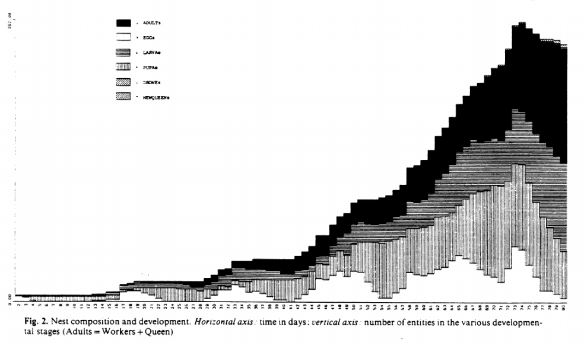
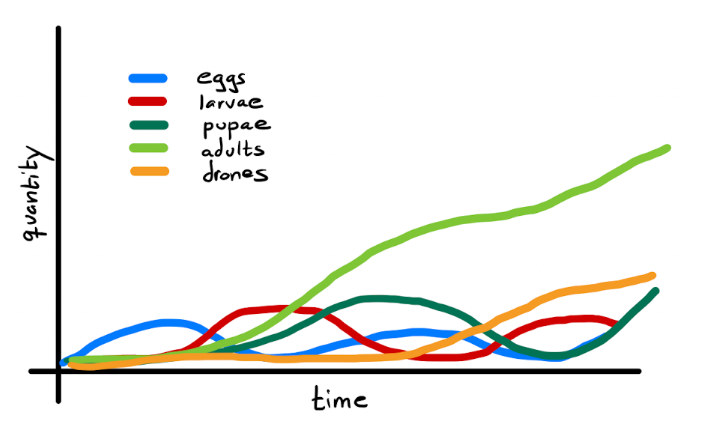
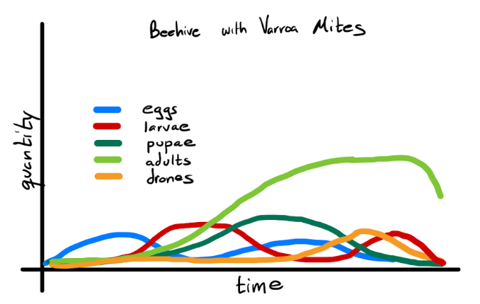

# An Agent-Based Beehive Model with the Inclusion of Parasitic Varroa Mites
### Will Fairman and David Tarazi

## Abstract
The authors of [this paper](https://www.researchgate.net/publication/226134851) utilize a MIRROR agent-based model to simulate interactions between bees in order to achieve the ‘macro’ behavior of a beehive. The model looks at individual bee behavior based on the type of bee (egg, larvae, adult, etc.), location, and previous interactions with other bees. The model seeks to explore how beehives function and what ‘micro’ behaviors could explain the beehive behavior.  To measure their results, the authors compared behaviors observed in their model to behaviors of bees noted in scientific studies. Because the success of their model was confirmed through qualitative observations by bee experts, we plan on only measuring the success of our model  by comparing it to the quantitative observations found in the paper (size of different types of bees through nest progression). Our agent based replication will be created in Python with Jupyter Notebook.

## Proposal
The authors investigated how the population dynamics and ratios of each bee type in the model resembled that of studies conducted on beehives in nature.  We plan to replicate the population dynamics explored in the paper (type of bee, queen bee dominance, honey amount, etc.). As an expansion, we plan on adding parasites (varroa mites) in order to understand their impact on the beehive and colony health and hopefully generate a crude model of [colony collapse disorder](https://en.wikipedia.org/wiki/Colony_collapse_disorder).

In order to understand our results and compare them to the original authors’ results, we will analyze the trends from their results on population dynamics as shown in Figure 1 below. While the results should not exactly align, the trends that appear in our replication should follow the general guidelines of their results. The authors specify that the dominance relationships that exist throughout the beehive can be replicated through an individual dominance variable that each bee contains. Factors like population dynamics and queen stress create a shift in individual dominance variables leading to a shift in overall hive behavior. We plan on utilizing other visualizations to make these conclusions more clear assuming we can accurately replicate their results.

**Figure 1:** Quantity of eggs, larvae, pupae, adults, and drones within a beehive over simulated time as plotted by Hogeweg and Hesper.

We anticipate that when we implement their model and create our results, they will resemble something like the drafts in Figures 2 and 3.

**Figure 2:** Representation of Figure 1 with our own model. Shows population dynamics that model real-world beehives.

**Figure 3:** Representation of a colony collapse due to the introduction of Varroa Mites.

We have already read the paper we are exploring in depth, but there were a few notions in their model with regards to bee behavior that we didn’t understand. As one of our first next steps, we will need to do a little bit of research about bees and their behaviors in order to better understand the model itself. Then, we feel that we can begin replicating the beehive experiment in Python and at least organize some of the classes that will be necessary to run this experiment.

As far as concerns go, we are worried about the scope of this project. The model is much more complex than models we have implemented in class and we worry that it will take a lot of time and effort to implement the model itself and that debugging it will be difficult. Furthermore, there are a few areas of the model description in the paper that are vague or don’t make sense to us and we worry that due to these few unclear descriptions, we will end up with results that don’t match the authors’ results. Finally, most of the results provided in the original paper are not quantitative and show more qualitative trends, so we fear that even if we think our results are comparable, it will be difficult to assess.

## Annotated Bibliography
[The Ontogeny of the Interaction Structure in Bumble Bee Colonies: A MIRROR Model](https://www.researchgate.net/publication/226134851_The_ontogeny_of_the_interaction_structure_in_bumble_bee_colonies_A_MIRROR_model)  
Hogeweg, P. and Hesper, B. (1983), 'The Ontogeny of the Interaction Structure in Bumble Bee Colonies: A MIRROR Model', Behavioral Ecology and Sociobiology, 12(4): 271-283
>The authors of this paper create a model for beehive behavior through bee agents of different roles within the hive. 

[Bumble Bee Colonies](https://www.gisagents.org/2015/03/bumble-bee-colonies.html)
Crooks, Andrew. “Bumble Bee Colonies.” GIS and Agent-Based Modeling, Mar. 2015, https://www.gisagents.org/2015/03/bumble-bee-colonies.html. 
>This website shows an implementation of the original paper we are trying to replicate which has a nice animation and gives us some inspiration on which variables matter to visualize.
